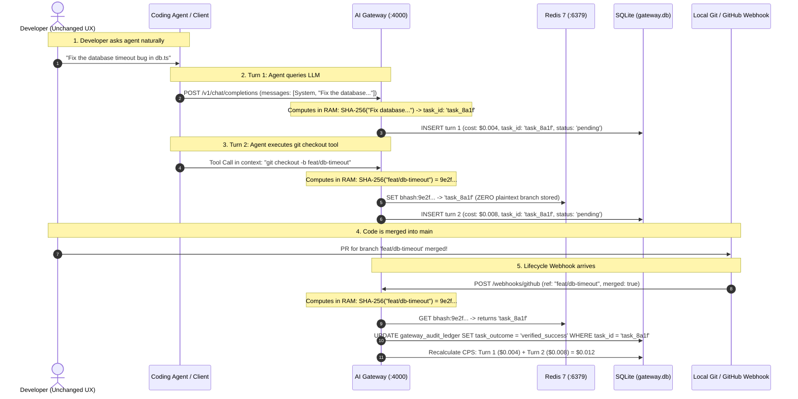

# Sub-specification — SUB-POC-02: SQLite Ledger, Observability & Cryptographic Zero Data Retention (ZDR)

**Parent Spec:** [SPEC_AI_GATEWAY_LOCAL_POC.md](file:///Users/mako/Mukesh_Workspace/Projects/Extras:Test/LLM%20Gateway/docs/SPEC_AI_GATEWAY_LOCAL_POC.md)  
**Sub-spec ID:** SUB-POC-02  
**Status:** Approved Baseline  
**Date:** September 2026  
**Classification:** Data Persistence, Compliance Auditing, Distributed Tracing & FinOps  

---

## 1. Objective

Define the persistence architecture, compliance auditing rules, telemetry export pipeline, zero-touch correlation engine, and FinOps metrics for the Local AI Gateway PoC.

This sub-specification establishes:
1. The **Embedded SQLite Audit Ledger (`gateway.db`)**, running in high-concurrency **Write-Ahead Logging (WAL)** mode as a zero-process embedded database.
2. The **Cryptographic Zero Data Retention (ZDR) Invariant**, guaranteeing that no prompt, completion, or source code plaintext is ever written to disk or telemetry sinks—recording strictly 64-character SHA-256 digests.
3. The **Zero-Touch Root-Prompt Hashing Engine**, correlating multi-turn coding sessions into deterministic `task_id` values based on tree invariance without requiring developers to inject manual HTTP headers.
4. The **Cost Per Success (CPS) Reconciliation Engine**, matching Git PR merge lifecycle webhooks to Redis branch hashes via a lightweight companion webhook listener on port `4001` to calculate the exact dollar cost per verified merged PR.
5. The **OpenTelemetry (OTel v2) & Jaeger Observability Stack**, defining the complete telemetry manifest, distributed tracing waterfall on `:16686`, and an Enterprise Reference dashboard design.

---

## 2. Scope & Non-Goals

### 2.1 In Scope
- **Embedded Database Architecture**: Schema, performance indexes, and analytical views for `gateway.db` in SQLite 3 WAL mode.
- **Cryptographic ZDR Enforcement**: In-RAM hashing of input prompts and output completions into SHA-256 hex strings prior to logging.
- **Zero-Touch Session Correlation**: Derivation of deterministic `task_id` via invariant root-prompt hashing in `custom_zdr_logger.py`.
- **Git Lifecycle Webhook Reconciliation**: Companion ingress handler (`cps_webhook_server.py` on `:4001`) for GitHub merge events (`POST /webhooks/github`), updating task outcomes and computing CPS in `gateway.db`.
- **Distributed Tracing & Metrics**: OpenTelemetry OTLP export over gRPC (`:4317`) into Jaeger All-In-One (`:16686`).
- **Automated Compliance Verification**: SQL view `v_zdr_compliance_check` proving 100% adherence to zero plaintext retention.
- **Enterprise Reference Dashboard**: 6-panel visualization design for remote enterprise Grafana deployment.

### 2.2 Non-Goals
- Ingress reverse proxying and RBAC gatekeeping (governed by [SUB-POC-01](file:///Users/mako/Mukesh_Workspace/Projects/Extras:Test/LLM%20Gateway/docs/sub_specs/SUB_POC_01_CORE_LITELLM_RBAC_AND_REDIS.md)).
- Redis sliding-window token bucket state (governed by [SUB-POC-01](file:///Users/mako/Mukesh_Workspace/Projects/Extras:Test/LLM%20Gateway/docs/sub_specs/SUB_POC_01_CORE_LITELLM_RBAC_AND_REDIS.md)).
- Multi-container Docker deployment manifests and runbook scripts (governed by [SUB-POC-03](file:///Users/mako/Mukesh_Workspace/Projects/Extras:Test/LLM%20Gateway/docs/sub_specs/SUB_POC_03_CONFIGS_MOCK_FILES_AND_EXTRAS.md)).
- Localhost Grafana container hosting (the Local PoC standardizes entirely on native Jaeger UI on `:16686` and LiteLLM Web UI on `:4000/ui` to minimize memory overhead).
- Multi-tenant enterprise PostgreSQL clustering (the Local PoC standardizes entirely on embedded SQLite).

---

## 3. Functional Requirements

| ID | Requirement | Master Spec Source | Priority |
| :--- | :--- | :--- | :--- |
| **REQ-DATA-01** | The gateway MUST persist audit records to an embedded SQLite database (`/app/gateway.db`) configured in Write-Ahead Logging (`WAL`) mode with `NORMAL` synchronous execution. | §2.4 SQLite Audit Ledger | Must |
| **REQ-DATA-02** | The database MUST enforce the Cryptographic ZDR Invariant: columns `prompt_sha256` and `completion_sha256` MUST contain strictly 64-character hexadecimal digests. Under NO circumstance may cleartext prompts or completions be written to disk. | §2.4 & §3.4 Auditing & ZDR | Must |
| **REQ-DATA-03** | The gateway MUST compute ephemeral SHA-256 hashes of prompts and completions in transient RAM and discard the raw string buffers immediately following dispatch/logging. | §3.4 Cryptographic SHA-256 | Must |
| **REQ-DATA-04** | The gateway MUST autonomously assign a deterministic `task_id` to multi-turn requests by hashing the invariant root prompt (`messages[1]`) combined with the caller key alias, requiring zero custom client headers. | §2.6 Zero-Touch Task ID | Must |
| **REQ-DATA-05** | When an agent references a Git branch, the gateway hook MUST store strictly `bhash:<sha256(branch)> -> task_id` in Redis. Plaintext branch names MUST NOT be persisted. | §2.6 ZDR Git Bridge | Must |
| **REQ-DATA-06** | The gateway ecosystem MUST expose an endpoint `POST /webhooks/github` (served via companion service `cps_webhook_server.py` on `http://localhost:4001/webhooks/github`) that receives Git merge payloads, hashes the incoming `head.ref`, resolves `task_id` from Redis, and updates the task outcome in `gateway.db`. | §2.6 Sequence Step 5 | Must |
| **REQ-DATA-07** | The database MUST provide an analytical view `v_coding_cps_summary` calculating cumulative turns, tokens, and final Cost Per Success ($CPS$) for all resolved coding tasks. | §5.1 SQLite Schema View | Must |
| **REQ-DATA-08** | The gateway MUST export OpenTelemetry v2 spans via OTLP gRPC to `http://jaeger:4317` with W3C `traceparent` propagation. | §2.5 Observability & §3.1 Monitoring | Must |
| **REQ-DATA-09** | Telemetry spans exported by LiteLLM MUST record standard GenAI semantic attributes (model, token counts, latency). Custom compliance/CPS attributes (`task_id`, `prompt_sha256`) MUST be recorded in `gateway_audit_ledger` and enriched in trace spans by `custom_zdr_logger.py`. | §2.5.1 Telemetry Manifest | Must |
| **REQ-DATA-10** | The database MUST expose an automated compliance query `v_zdr_compliance_check` asserting that zero records contain prohibited cleartext or invalid hash lengths. | §2.4 Compliance Invariant | Must |

---

## 4. Embedded SQLite Database Architecture (`gateway.db`)

### 4.1 WAL Concurrency Configuration
SQLite runs directly in-process without requiring a separate database server. To support high-throughput concurrent logging without read/write blocking, the database is initialized with:

```sql
PRAGMA journal_mode = WAL;
PRAGMA synchronous = NORMAL;
PRAGMA busy_timeout = 5000;
PRAGMA cache_size = -64000; -- 64MB memory cache
PRAGMA foreign_keys = ON;
```

### 4.2 Data Definition Language (DDL) Specification

```sql
-- =============================================================================
-- Minimal Local AI Gateway: Single-Table SQLite Ledger
-- =============================================================================

CREATE TABLE IF NOT EXISTS gateway_audit_ledger (
    request_id TEXT PRIMARY KEY,
    trace_id TEXT NOT NULL,
    created_at DATETIME DEFAULT CURRENT_TIMESTAMP,
    
    -- Governance & Identity
    api_key_alias TEXT NOT NULL,
    caller_role TEXT NOT NULL DEFAULT 'developer',
    
    -- Model Routing & Execution
    model_requested TEXT NOT NULL,
    model_routed TEXT NOT NULL,
    fallback_triggered INTEGER DEFAULT 0,
    http_status INTEGER NOT NULL,
    latency_ms REAL NOT NULL,
    
    -- Token & Financial Metering
    prompt_tokens INTEGER NOT NULL DEFAULT 0,
    completion_tokens INTEGER NOT NULL DEFAULT 0,
    cost_usd REAL NOT NULL DEFAULT 0.0,
    
    -- Cryptographic Zero Data Retention (ZDR)
    -- Invariant: Strictly SHA-256 digests. NO cleartext persisted.
    prompt_sha256 TEXT NOT NULL,
    completion_sha256 TEXT NOT NULL,
    zdr_verified INTEGER DEFAULT 1,
    
    -- Coding Task Cost Per Success (CPS) Reconciliation
    task_id TEXT,                         -- e.g. 'task_8a1f10b2c3d4'
    task_outcome TEXT DEFAULT 'pending'   -- 'pending', 'verified_success', 'unmerged_closed'
);

-- Fast lookup indexes
CREATE INDEX IF NOT EXISTS idx_trace_id ON gateway_audit_ledger(trace_id);
CREATE INDEX IF NOT EXISTS idx_task_id ON gateway_audit_ledger(task_id);
CREATE INDEX IF NOT EXISTS idx_created_at ON gateway_audit_ledger(created_at);
```

### 4.3 Analytical & Compliance Views

#### Real-Time Coding CPS Summary View (`v_coding_cps_summary`)
Aggregates all multi-turn transactions across every coding task:

```sql
CREATE VIEW IF NOT EXISTS v_coding_cps_summary AS
SELECT 
    task_id,
    COUNT(request_id) AS total_turns,
    SUM(prompt_tokens + completion_tokens) AS total_tokens,
    ROUND(SUM(cost_usd), 6) AS accumulated_cost_usd,
    task_outcome,
    CASE 
        WHEN task_outcome = 'verified_success' THEN ROUND(SUM(cost_usd), 6)
        ELSE NULL 
    END AS final_cps_usd
FROM gateway_audit_ledger
WHERE task_id IS NOT NULL
GROUP BY task_id, task_outcome;
```

#### Automated ZDR Compliance Audit View (`v_zdr_compliance_check`)
Proves mathematically and forensically that no cleartext has leaked:

```sql
CREATE VIEW IF NOT EXISTS v_zdr_compliance_check AS
SELECT 
    COUNT(*) AS total_records,
    SUM(CASE WHEN LENGTH(prompt_sha256) = 64 AND prompt_sha256 GLOB '[0-9a-f]*' THEN 1 ELSE 0 END) AS valid_prompt_hashes,
    SUM(CASE WHEN LENGTH(completion_sha256) = 64 AND completion_sha256 GLOB '[0-9a-f]*' THEN 1 ELSE 0 END) AS valid_completion_hashes,
    SUM(CASE WHEN zdr_verified = 1 THEN 1 ELSE 0 END) AS zdr_flags_valid,
    CASE 
        WHEN COUNT(*) = SUM(CASE WHEN LENGTH(prompt_sha256) = 64 AND prompt_sha256 GLOB '[0-9a-f]*' THEN 1 ELSE 0 END)
         AND COUNT(*) = SUM(CASE WHEN LENGTH(completion_sha256) = 64 AND completion_sha256 GLOB '[0-9a-f]*' THEN 1 ELSE 0 END)
        THEN '100% COMPLIANT - ZERO PLAINTEXT DETECTED'
        ELSE 'VIOLATION DETECTED - AUDIT REQUIRED'
    END AS compliance_status
FROM gateway_audit_ledger;
```

---

## 5. Zero-Touch Correlation Engine & Cost Per Success ($CPS$)

### 5.1 The Two-Step Cryptographic Correlation Workflow

Developers interact with agents naturally. The gateway correlates multi-turn sessions and Git PR merges through **cryptographic digests calculated in RAM**:



### 5.2 Step 1: Root-Prompt Tree Invariance Formula
In conversational coding agents, each follow-up turn includes the conversation history. The root user prompt (`messages[1]`) is completely invariant across all turns $1 \dots N$:

$$\text{TaskDigest} = \text{SHA-256}(\text{KeyAlias} + \text{"::"} + \text{messages}[1][\text{'content'}][:500])$$
$$\text{task\_id} = \text{"task\_"} + \text{TaskDigest}[:16]$$

- **Determinism**: Every turn for the same task generates the identical 16-character hex suffix.
- **Zero Configuration**: Developer uses standard tools (Cursor, Claude Code, OpenAI SDK) without setting custom headers.

### 5.3 Step 2: ZDR-Compliant Hashed Branch Indexing
When the agent executes a git tool to checkout or push a branch (e.g. `feat/db-timeout`), the gateway's custom callback (`custom_zdr_logger.py`) detects the branch command via regex in transient RAM, computes the cryptographic digest, and stores **strictly the 64-character hash** in Redis:

$$\text{BranchDigest} = \text{SHA-256}(\text{"feat/db-timeout"}) \longrightarrow \text{"9e2f4a..."}$$

```redis
SET bhash:9e2f4a... "task_8a1f10b2c3d4" EX 604800
```

- **ZDR Invariant Maintained**: Zero plaintext branch names, zero code, and zero customer identifiers exist in Redis.
- When the merge webhook arrives, the webhook handler hashes the incoming `head.ref`, matches `bhash:9e2f4a...` in Redis, and resolves the task in SQLite.

### 5.4 Step 3: Lifecycle Webhook Reconciliation & CPS Calculation
Because the stock LiteLLM proxy container focuses strictly on reverse proxying, the GitHub PR merge webhook is handled by a lightweight companion service `cps_webhook_server.py` running on `http://localhost:4001/webhooks/github` (sharing the Docker volumes for SQLite and Redis).

When the pull request is merged into `main`, GitHub or the local simulator dispatches `POST http://localhost:4001/webhooks/github`:

```json
{
  "action": "closed",
  "pull_request": {
    "merged": true,
    "head": {
      "ref": "feat/db-timeout"
    },
    "merge_commit_sha": "d4e2f81a7b..."
  }
}
```

1. The companion service computes $\text{SHA-256}(\text{"feat/db-timeout"})$ in memory.
2. Performs Redis lookup `GET bhash:9e2f4a...` $\rightarrow$ returns `task_8a1f10b2c3d4`.
3. Executes atomic SQLite update in `gateway.db`:
   ```sql
   UPDATE gateway_audit_ledger
   SET task_outcome = 'verified_success'
   WHERE task_id = 'task_8a1f10b2c3d4';
   ```
4. Cost Per Success ($CPS$) is calculated immediately via `v_coding_cps_summary`:
   $$CPS = \sum_{i=1}^N \text{Cost}_i \quad \text{for all turns of task\_8a1f10b2c3d4}$$

---

## 6. Observability Deep-Dive: Metrics, Tracing & Dashboards

### 6.1 The Complete Telemetry Manifest

| Category | Telemetry Field / Metric Name | Type | Description |
| :--- | :--- | :--- | :--- |
| **Identity** | `gen_ai.user.key_alias` | Attribute | Virtual API key alias (e.g. `sk-agent-developer`) |
| **Identity** | `gen_ai.user.role` | Attribute | Caller RBAC role (`admin`, `developer`, `intern`) |
| **Routing** | `gen_ai.request.model` | Attribute | Logical model requested by client (e.g. `gpt-4o`) |
| **Routing** | `gen_ai.response.model` | Attribute | Actual model routed (e.g. `claude-3-5-sonnet` if fallback occurred) |
| **Routing** | `gen_ai.fallback_triggered` | Boolean | True if primary model failed and failover executed |
| **Performance** | `gen_ai.client.operation.duration` | Histogram | End-to-end request duration in seconds |
| **Performance** | `gen_ai.client.time_to_first_token` | Gauge / Span | Time to First Token (TTFT) for streaming requests |
| **Tokens** | `gen_ai.usage.input_tokens` | Counter | Prompt token consumption |
| **Tokens** | `gen_ai.usage.output_tokens` | Counter | Completion token generation |
| **Tokens** | `gen_ai.usage.total_tokens` | Counter | Cumulative tokens billed |
| **Economics** | `gen_ai.request.cost_usd` | Gauge | Exact dollar cost calculated from active rate cards |
| **Economics** | `litellm_spend_total{key}` | Counter | Cumulative dollar spend per key |
| **Security** | `gen_ai.prompt.sha256` | 64-char Hex | Cryptographic SHA-256 hash of input prompt |
| **Security** | `gen_ai.completion.sha256` | 64-char Hex | Cryptographic SHA-256 hash of generated completion |
| **Security** | `gen_ai.guardrail.pii_redacted` | Boolean | True if native regex guardrail scrubbed secrets/PII |
| **Status** | `http.status_code` | Attribute | HTTP response status (200, 401, 403, 429, 500) |
| **CPS** | `gen_ai.task.id` | Attribute | Coding task identifier (e.g. `task_8a1f10b2c3d4`) |
| **CPS** | `gen_ai.task.outcome` | Attribute | Resolution status (`pending`, `verified_success`, `unmerged_closed`) |
| **CPS** | `gen_ai.task.cost_per_success` | Gauge | Final Dollar Cost Per Verified PR Merge |

### 6.2 Jaeger Distributed Tracing Architecture
- **Export Protocol**: OpenTelemetry v2 OTLP over gRPC on `jaeger:4317`.
- **Trace Visualization Web UI**: `http://localhost:16686`.
- **Span Hierarchy**:
  ```
  litellm_request [HTTP POST /v1/chat/completions]
  ├── pep_ingress_verification (evaluates key, role, whitelist, budget)
  ├── redis_rate_limit_check (evaluates sliding window in <0.5ms)
  ├── upstream_llm_call (OpenAI / Anthropic inference)
  └── zdr_audit_callback (computes SHA-256 in RAM & writes to SQLite)
  ```

### 6.3 Enterprise Reference Dashboard Specification (Grafana Remote Tier / Future Phase)

> [!NOTE]
> For the 100% Localhost PoC, operational telemetry and request tracing are inspected natively via the **Jaeger UI (`http://localhost:16686`)** and the **LiteLLM Admin UI (`http://localhost:4000/ui`)**. The 6-panel layout below defines the reference dashboard design for remote enterprise Grafana deployments (`:3000`):

```
┌───────────────────────────────────────┬───────────────────────────────────────┐
│ PANEL 1: Real-Time Spend & Budget Burn│ PANEL 2: Latency & TTFT Distribution  │
│ [Gauge: $3.42 / $5.00 Cap]            │ [P50: 320ms | P95: 1,150ms | P99: 2.1s│
│ Time-Series graph of $/hr per key     │ Histogram of inference durations      │
├───────────────────────────────────────┼───────────────────────────────────────┤
│ PANEL 3: Model Usage & Failover Counts│ PANEL 4: Rate Limits & RBAC Rejections│
│ [Bar Chart: 72% GPT-4o, 28% Claude]   │ [Counter: 14 HTTP 429s, 3 HTTP 403s]  │
│ Alert indicator on fallback triggers  │ Breakdown by key and client IP        │
├───────────────────────────────────────┼───────────────────────────────────────┤
│ PANEL 5: Cryptographic ZDR Audit Log  │ PANEL 6: Coding Task Cost Per Success │
│ [Table: Timestamp | Key | Model |     │ [Table: Task ID | Turns | Total Cost |│
│  Prompt SHA-256 | Completion SHA-256] │  Outcome | Final CPS ($/Merged PR)]   │
└───────────────────────────────────────┴───────────────────────────────────────┘
```

---

## 7. Acceptance Criteria & Audit Plan

| AC ID | Target Requirement | Command / Procedure | Expected Status | Assertion Criteria |
| :--- | :--- | :--- | :--- | :--- |
| **AC-DATA-01** | **REQ-DATA-01** | `sqlite3 gateway.db ".tables"` | `Exit 0` | Table `gateway_audit_ledger` and views present |
| **AC-DATA-02** | **REQ-DATA-01** | `sqlite3 gateway.db "PRAGMA journal_mode;"` | `wal` | Journal mode is strictly `wal` |
| **AC-DATA-03** | **REQ-DATA-02, REQ-DATA-10** | `sqlite3 gateway.db "SELECT * FROM v_zdr_compliance_check;"` | `Exit 0` | `100% COMPLIANT - ZERO PLAINTEXT DETECTED` |
| **AC-DATA-04** | **REQ-DATA-04** | Submit 2 turns with same root prompt; inspect DB | `Exit 0` | Both rows contain identical `task_id` (`task_...`) |
| **AC-DATA-05** | **REQ-DATA-05** | Run inference with git branch tool call; inspect Redis | `Exit 0` | Key `bhash:<sha256>` exists with string value `task_id` |
| **AC-DATA-06** | **REQ-DATA-06** | Post mock merge payload to `http://localhost:4001/webhooks/github` | `HTTP 200 OK` | `gateway_audit_ledger.task_outcome` updates from `pending` to `verified_success` |
| **AC-DATA-07** | **REQ-DATA-07** | `sqlite3 gateway.db "SELECT * FROM v_coding_cps_summary;"` | `Exit 0` | Output aggregates turns, tokens, and non-null `final_cps_usd` |
| **AC-DATA-08** | **REQ-DATA-08** | Open `http://localhost:16686` and search traces for `litellm` | `HTTP 200 OK` | Complete trace waterfall visible with OTLP spans |
| **AC-DATA-09** | **REQ-DATA-09** | Inspect span tags in Jaeger UI and corresponding SQLite row | `Exit 0` | Span tags carry GenAI attributes; SQLite ledger carries SHA-256 hashes |
| **AC-DATA-10** | **REQ-DATA-03** | Inspect SQLite schema columns for payload leaks | `Exit 0` | Zero columns named `prompt`, `completion`, `message`, or `content` |

---

## 8. Master Spec Traceability Matrix

| Master Specification Section | Traceability & Scope Alignment in SUB-POC-02 |
| :--- | :--- |
| **§1.2 Architecture Stack (Layer 4 & 7)** | Embedded SQLite Memory/State layer and OTel Control/Ops layer. |
| **§1.3 Local Topology Blueprint** | ZDRHook, CPSHook, SQLite, and Jaeger/Grafana telemetry connections. |
| **§2.4 Embedded SQLite Audit & CPS Ledger** | Database schema, index strategy, and `v_coding_cps_summary`. |
| **§2.5 Observability Deep-Dive** | Complete Telemetry Manifest and 6-panel dashboard specification. |
| **§2.6 Zero-Touch Task ID & ZDR Git Bridge** | Root-prompt hashing tree invariance, hashed branch indexing, and CPS reconciliation. |
| **§3.1 Monitoring & §3.4 Auditing/ZDR** | OTLP gRPC export and transient RAM SHA-256 cryptographic guarantees. |
| **§5.1 SQLite Database Schema** | Complete production DDL script `sqlite_schema.sql`. |
