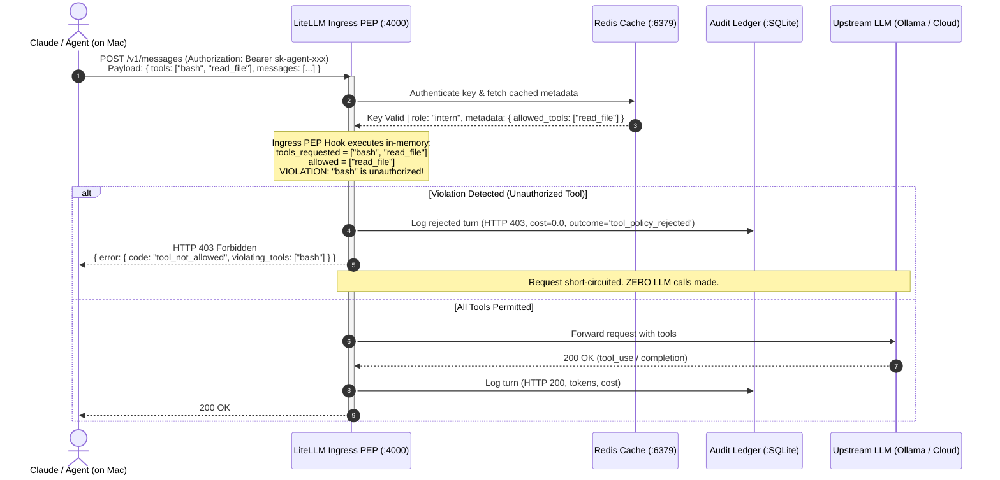

# Sub-specification — SUB-POC-04: MCP Tool Interrupt & Gateway Ingress Policy Enforcement Point (PEP)

**Parent Spec:** [SPEC_AI_GATEWAY_LOCAL_POC.md](file:///Users/mako/Mukesh_Workspace/Projects/Extras:Test/LLM%20Gateway/PoCs/AI_Gateway/docs/SPEC_AI_GATEWAY_LOCAL_POC.md)  
**Sub-spec ID:** SUB-POC-04  
**Branch:** `feat/MCPInterrupt`  
**Status:** Draft / Review  
**Date:** September 2026  
**Classification:** Security Architecture, MCP Tool Governance & Ingress Pre-Call Enforcement  

---

## 1. Executive Summary & Problem Statement

### 1.1 Context & Tool Execution Architecture
In the Local AI Gateway architecture, agentic tools (such as Model Context Protocol / MCP servers: `@modelcontextprotocol/server-filesystem`, `@modelcontextprotocol/server-git`, shell execution wrappers, database query engines) execute **locally on the developer's macOS host**, **not inside LiteLLM or containerized gateway processes**:

```
+--------------------------------------------------------------------------+
|                            macOS Host Machine                            |
|                                                                          |
|  +--------------------+                     +-------------------------+  |
|  |  Claude Client     |                     |    Local MCP Servers    |  |
|  |  (Claude Code,     | <--- stdio/SSE ---> |  (git, filesystem,      |  |
|  |   Desktop, Agent)  |                     |   bash, sqlite, etc.)   |  |
|  +--------------------+                     +-------------------------+  |
|            |                                             ^               |
|            | HTTP POST /v1/messages                      | Executes      |
|            | payload includes `tools: [...]`             | tool call     |
|            v                                             | on Mac        |
|  +----------------------------------------------------+  |               |
|  |  AI Gateway (Docker: LiteLLM @ :4000)              |  |               |
|  |  --> Ingress PEP Hook (SUB-POC-04)                 |  |               |
|  |      * Inspects declared `tools` in payload        |  |               |
|  |      * Matches against API key's whitelist         |  |               |
|  |      * [Violation] => HTTP 403 tool_not_allowed    |  |               |
|  +----------------------------------------------------+  |               |
|            | (If Permitted)                              |               |
|            v                                             |               |
|  +------------------------------------+                  |               |
|  |  Model Backend (Ollama / Cloud)    | -----------------+               |
|  +------------------------------------+                                  |
+--------------------------------------------------------------------------+
```

When an agent like Claude interacts with an LLM through LiteLLM (`POST /v1/messages` or `POST /v1/chat/completions`), it advertises available tools by embedding their complete definitions, schemas, and identifiers into the request's `tools` array.

### 1.2 The Threat Model
Without an Ingress Policy Enforcement Point (PEP):
1. **Unrestricted Tool Capabilities**: An untrusted, sandboxed, or junior/intern agent provisioned with a restricted API key could advertise high-privilege MCP tools (e.g., `execute_command`, `write_file`, `drop_table`, `git_push`) to the model.
2. **Upstream Token Consumption & Reasoning Exploitation**: The upstream model would ingest the forbidden tool schemas, generate tool call invocations, and return them to the client on the Mac. The client would then execute those commands locally with the user's host OS privileges.
3. **Prompt Injection / Jailbreak Vulnerabilities**: Prompt injections could steer models into utilizing high-risk tools that the agent's key should never have possessed in the first place.

### 1.3 The Solution: Gateway Ingress PEP (MCP Interrupt)
LiteLLM must serve as an authoritative **Ingress Policy Enforcement Point (PEP)** via an asynchronous pre-call hook (`async_pre_call_hook`). 

Before routing, token counting, or contacting any LLM backend:
- The hook inspects the incoming request's `tools` list.
- It extracts all declared tool names.
- It validates every tool against the virtual API key's explicit whitelist (`allowed_tools` defined in the key's metadata).
- If **any** tool is not permitted, the gateway **immediately terminates the request** with **`HTTP 403 Forbidden`** and error code **`tool_not_allowed`**, preventing upstream model dispatch and guaranteeing **zero upstream token spend**.

---

## 2. Scope & Non-Goals

### 2.1 In Scope
- **Ingress Tool Schema Inspection**: Interception and extraction of tool definitions across both Anthropic Messages schema (`/v1/messages`) and OpenAI Chat Completions schema (`/v1/chat/completions`).
- **Key Metadata Whitelist Enforcement**: Policy validation against `allowed_tools` defined in LiteLLM virtual key metadata.
- **Pattern & Wildcard Matching**: Support for exact names (e.g., `read_file`), namespace wildcards (e.g., `git_*`, `filesystem:read_*`), and universal allow (`*`).
- **Pre-Call Interruption (`HTTP 403`)**: Immediate short-circuiting prior to router invocation, upstream network I/O, or token generation.
- **Zero Data Retention (ZDR) & Audit Logging**: Non-plaintext recording of blocked events into `gateway_audit_ledger` (HTTP 403, zero cost, `task_outcome='tool_policy_rejected'`).
- **Telemetry & Prometheus Metrics**: Emitting real-time Prometheus counters (`ai_gateway_tool_violations_total`) and annotating OpenTelemetry trace spans.

### 2.2 Non-Goals
- Host-level sandboxing or OS process control (LiteLLM runs in Docker; host MCP execution security is governed by the host OS user).
- In-flight tool argument payload inspection or modification (policy applies to tool accessibility/declaration at ingress).
- Modifying client-side MCP configs (`mcp_servers.json`).

---

## 3. Functional Requirements

| ID | Requirement | Priority | Verification Method |
| :--- | :--- | :--- | :--- |
| **REQ-MCP-01** | The gateway MUST intercept incoming requests on `/v1/messages` and `/v1/chat/completions` before dispatching to any model router. | Must | Integration test timing / Zero upstream calls |
| **REQ-MCP-02** | The Gateway Ingress PEP MUST extract declared tool names from both Anthropic schema (`tool.name`) and OpenAI schema (`tool.function.name` or legacy `functions`). | Must | Dual-schema test vectors |
| **REQ-MCP-03** | The gateway MUST retrieve the calling key's `allowed_tools` whitelist from LiteLLM key metadata (`user_api_key_dict.metadata["allowed_tools"]`). | Must | Key metadata lookup test |
| **REQ-MCP-04A** | In `strict_reject` mode (`metadata.tool_policy="strict_reject"`), if a request contains ANY tool name not included in or matched by `allowed_tools`, the gateway MUST abort and return `HTTP 403 Forbidden`. | Must | HTTP 403 assertion |
| **REQ-MCP-04B** | In `filter` mode (`metadata.tool_policy="filter"`, default for coding agent compatibility), the gateway MUST prune/strip unauthorized tools from `data["tools"]` so the model never sees them, allowing coding agents to start and function normally (HTTP 200 OK). | Must | Agent tool pruning test |
| **REQ-MCP-05** | The HTTP 403 response body for rejected requests MUST contain error code `tool_not_allowed`, the list of violating tools, and the permitted tools. | Must | JSON body schema assertion |
| **REQ-MCP-06** | The policy engine MUST support wildcard matching (e.g. `*` allows all tools, `git_*` allows all git tools). | Must | Wildcard unit tests |
| **REQ-MCP-07** | If `allowed_tools` is omitted or null on a virtual key, the gateway MUST apply the default role policy (Developer = `*`, Intern = `["read_file", "git_status", "git_diff"]`). | Should | Default role policy test |
| **REQ-MCP-08** | Disallowed requests MUST consume exactly 0 upstream tokens and incur $0.00 cost. | Must | Upstream mock / spend verify |
| **REQ-MCP-09** | Disallowed attempts MUST be logged in `gateway_audit_ledger` with `http_status=403`, `task_outcome='tool_policy_rejected'`, and ZDR SHA-256 prompt hashing. | Must | SQLite ledger inspection |
| **REQ-MCP-10** | Disallowed attempts MUST increment Prometheus counter `ai_gateway_tool_violations_total` labeled by `key_alias` and `violating_tool`. | Should | `/metrics` scraping assert |
| **REQ-MCP-11** | LiteLLM's internal naive auth check is bypassed in favor of the ZDR PEP to allow wildcards (`*`) and tool pruning without fatal client crashes. | Must | Bypass assertion |

---

## 4. Architecture & Request Flow

### 4.1 Ingress Policy Enforcement Sequence



### 4.2 Whitelist Evaluation Logic
Let $T_{req} = \{t_1, t_2, \dots, t_n\}$ be the set of tool names declared in the incoming request payload.  
Let $W_{key} = \{w_1, w_2, \dots, w_m\}$ be the whitelist patterns configured on the caller's virtual key.

A tool $t \in T_{req}$ is authorized if and only if:
$$\exists w \in W_{key} \quad \text{such that} \quad \text{fnmatch}(t, w) = \text{True}$$

The violation set $V$ is defined as:
$$V = \{ t \in T_{req} \mid \forall w \in W_{key}, \neg \text{fnmatch}(t, w) \}$$

If $V \neq \emptyset$:
$$\text{Trigger Ingress Interrupt} \implies \text{Raise } \text{HTTPException}(403, \text{code}=\text{"tool_not_allowed"}, \text{violating}=V)$$

---

## 5. Interface Contracts & Data Schemas

### 5.1 Virtual API Key Metadata Schema
Virtual keys provisioned via `/key/generate` or `setup.sh` include `metadata.allowed_tools`:

```json
{
  "key_alias": "sk-agent-intern",
  "models": ["gpt-4o-mini", "qwen3.5:4b-mlx"],
  "max_budget": 5.0,
  "metadata": {
    "role": "intern",
    "allowed_tools": [
      "read_file",
      "list_dir",
      "git_status",
      "git_diff"
    ],
    "tool_policy": "strict_whitelist"
  }
}
```

For developer keys with full MCP access:
```json
{
  "key_alias": "sk-agent-developer",
  "models": ["gpt-4o", "claude-3-5-sonnet", "qwen3.5:9b-mlx"],
  "metadata": {
    "role": "developer",
    "allowed_tools": ["*"],
    "tool_policy": "permissive"
  }
}
```

### 5.2 Ingress Request Payloads

#### Anthropic Messages API (`/v1/messages`)
```json
{
  "model": "claude-3-5-sonnet",
  "max_tokens": 1024,
  "messages": [
    {"role": "user", "content": "Check repository git status and execute clean up"}
  ],
  "tools": [
    {
      "name": "git_status",
      "description": "Show working tree status",
      "input_schema": {"type": "object", "properties": {}}
    },
    {
      "name": "bash",
      "description": "Execute arbitrary shell command on host",
      "input_schema": {"type": "object", "properties": {"command": {"type": "string"}}}
    }
  ]
}
```

#### OpenAI Chat Completions API (`/v1/chat/completions`)
```json
{
  "model": "gpt-4o",
  "messages": [{"role": "user", "content": "..."}],
  "tools": [
    {
      "type": "function",
      "function": {
        "name": "bash",
        "description": "Execute arbitrary shell command"
      }
    }
  ]
}
```

### 5.3 Error Response Schema (`HTTP 403 Forbidden`)

```json
{
  "error": {
    "message": "Tool execution policy violation: The following requested tool(s) are not permitted for this API key: ['bash']. Allowed tools: ['git_status', 'read_file'].",
    "type": "permission_error",
    "param": "tools",
    "code": "tool_not_allowed",
    "violating_tools": [
      "bash"
    ],
    "allowed_tools": [
      "git_status",
      "read_file"
    ],
    "key_alias": "sk-agent-intern"
  }
}
```

---

## 6. Implementation Architecture

### 6.1 Component Placement
The Ingress PEP will be implemented as a specialized LiteLLM pre-call hook:
- **File**: `custom_mcp_pep.py` (or integrated into `custom_zdr_logger.py`).
- **Hook Method**: `async_pre_call_hook(user_api_key_dict, cache, data, call_type)`
- **LiteLLM Config**: Registered under `litellm_settings.callbacks` in `litellm_config.yaml`.

```yaml
litellm_settings:
  turn_off_message_logging: true
  require_auth_for_metrics_endpoint: false
  callbacks:
    - "otel"
    - "prometheus"
    - "custom_mcp_pep.mcp_tool_pep"
    - "custom_zdr_logger.zdr_audit_logger"
```

### 6.2 Pre-Call Hook Algorithm

```python
import fnmatch
from typing import List, Set, Any, Dict, Optional
from fastapi import HTTPException
from litellm.integrations.custom_logger import CustomLogger
from litellm.proxy._types import UserAPIKeyAuth

class MCPToolPEP(CustomLogger):
    """
    Gateway Ingress Policy Enforcement Point (PEP).
    Inspects tool declarations in incoming request payloads and rejects unauthorized tools.
    """

    @staticmethod
    def extract_tools(data: Dict[str, Any]) -> List[str]:
        """Extracts tool names from both Anthropic and OpenAI schemas."""
        tool_names = []
        raw_tools = data.get("tools") or []
        for tool in raw_tools:
            if not isinstance(tool, dict):
                continue
            # Anthropic schema: {"name": "bash", ...}
            if "name" in tool and isinstance(tool["name"], str):
                tool_names.append(tool["name"])
            # OpenAI schema: {"type": "function", "function": {"name": "bash", ...}}
            elif "function" in tool and isinstance(tool["function"], dict):
                fn_name = tool["function"].get("name")
                if fn_name and isinstance(fn_name, str):
                    tool_names.append(fn_name)

        # Legacy OpenAI functions parameter
        raw_functions = data.get("functions") or []
        for fn in raw_functions:
            if isinstance(fn, dict) and "name" in fn:
                tool_names.append(fn["name"])

        return tool_names

    async def async_pre_call_hook(
        self,
        user_api_key_dict: UserAPIKeyAuth,
        cache: Any,
        data: Dict[str, Any],
        call_type: str,
    ) -> Optional[Dict[str, Any]]:
        # 1. Extract requested tools
        tools_requested = self.extract_tools(data)
        if not tools_requested:
            return data  # No tools requested, proceed

        # 2. Extract allowed tools from key metadata
        metadata = getattr(user_api_key_dict, "metadata", {}) or {}
        allowed_tools = metadata.get("allowed_tools")

        # 3. Default policy fallback by role if not explicitly set
        if allowed_tools is None:
            user_role = getattr(user_api_key_dict, "user_role", None) or metadata.get("role") or "developer"
            if user_role == "admin" or user_role == "developer":
                allowed_tools = ["*"]
            else:
                allowed_tools = ["read_file", "git_status", "git_diff"]

        # Universal allow check
        if "*" in allowed_tools:
            return data

        # 4. Check for violations
        violating_tools = []
        for tool in tools_requested:
            matched = any(fnmatch.fnmatch(tool, pattern) for pattern in allowed_tools)
            if not matched:
                violating_tools.append(tool)

        # 5. Interrupt if violations found
        if violating_tools:
            key_alias = getattr(user_api_key_dict, "key_alias", None) or "unknown_key"
            raise HTTPException(
                status_code=403,
                detail={
                    "error": {
                        "message": (
                            f"Tool execution policy violation: The following requested tool(s) "
                            f"are not permitted for this API key: {sorted(violating_tools)}. "
                            f"Allowed tools: {sorted(allowed_tools)}."
                        ),
                        "type": "permission_error",
                        "param": "tools",
                        "code": "tool_not_allowed",
                        "violating_tools": sorted(violating_tools),
                        "allowed_tools": sorted(allowed_tools),
                        "key_alias": key_alias,
                    }
                },
            )

        return data
```

---

## 7. Edge Cases & Resilience Strategy

| Edge Case | Behavior | Rationale |
| :--- | :--- | :--- |
| **No tools in payload** | Request passes through unaffected. | Standard completion / prompt-only queries must incur zero overhead. |
| **Empty `tools: []`** | Request passes through unaffected. | Agent declared empty toolset. |
| **Malformed tool object (e.g. integer or non-dict)** | Reject with `HTTP 400 Bad Request`. | Prevent parser bypasses or type confusion attacks. |
| **Case Sensitivity** | Tool matching is strict case-sensitive by default (`bash` $\neq$ `BASH`). | Prevents case-collision obfuscation. |
| **Sub-Millisecond Overhead** | Pure in-memory string list iteration; target latency $<0.15\text{ms}$. | Negligible impact on gateway latency. |
| **Streaming Calls (`stream=True`)** | Hook executes prior to stream generator creation; HTTP 403 returned cleanly before chunk 1. | Ensures zero tokens are streamed to client. |

---

## 8. Verification Runbook & Acceptance Tests

### Test Matrix

```
+---------+-------------------+---------------------+-------------------------+-----------------+
| Test ID | Role / Key        | Allowed Tools       | Requested Tools         | Expected Result |
+---------+-------------------+---------------------+-------------------------+-----------------+
| TC-01   | Developer         | ["*"]               | ["bash", "read_file"]   | 200 OK (Allow)  |
| TC-02   | Intern            | ["read_file"]       | ["read_file"]           | 200 OK (Allow)  |
| TC-03   | Intern            | ["read_file"]       | ["bash"]                | 403 (Interrupt) |
| TC-04   | Intern            | ["read_file"]       | ["read_file", "bash"]   | 403 (Interrupt) |
| TC-05   | Restricted Agent  | ["git_*"]           | ["git_status"]          | 200 OK (Allow)  |
| TC-06   | Restricted Agent  | ["git_*"]           | ["filesystem_write"]    | 403 (Interrupt) |
| TC-07   | No Tools          | Any                 | None / []               | 200 OK (Allow)  |
+---------+-------------------+---------------------+-------------------------+-----------------+
```

### Verification Script (`test_mcp_interrupt.py`)
A verification test script will execute the following curl / python validations against the gateway:
1. `POST /v1/messages` with allowed tool -> HTTP 200 returned.
2. `POST /v1/messages` with disallowed tool -> HTTP 403 with `code: "tool_not_allowed"` returned in $<5\text{ms}$.
3. Verify SQLite ledger records HTTP 403 with zero prompt/completion tokens.
4. Verify upstream backend received zero requests for the blocked turn.
